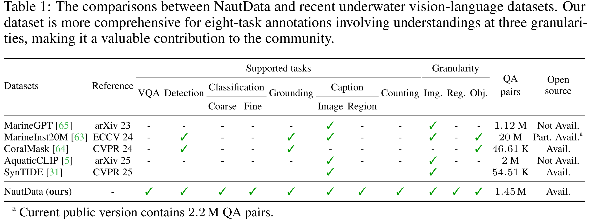
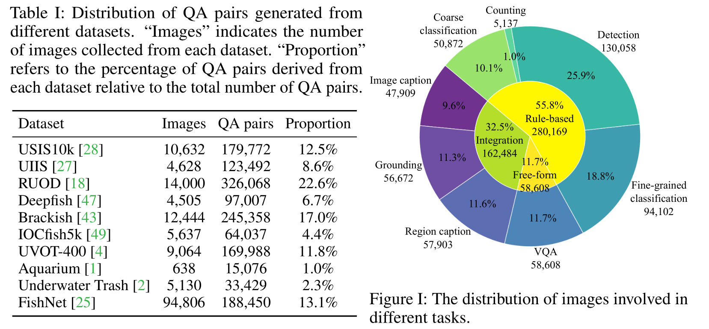
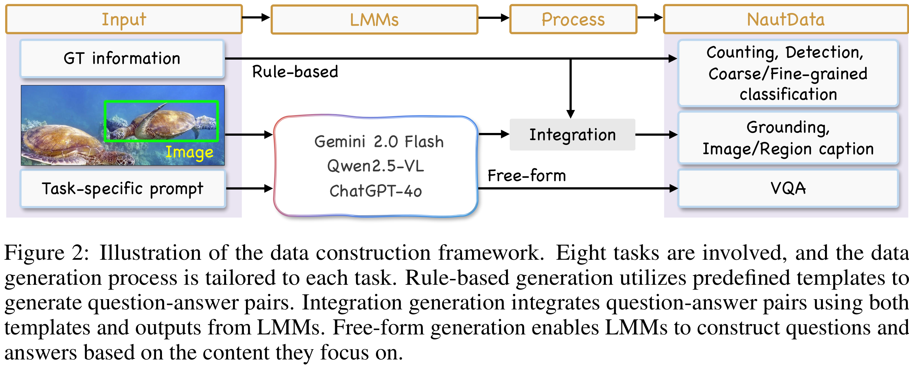
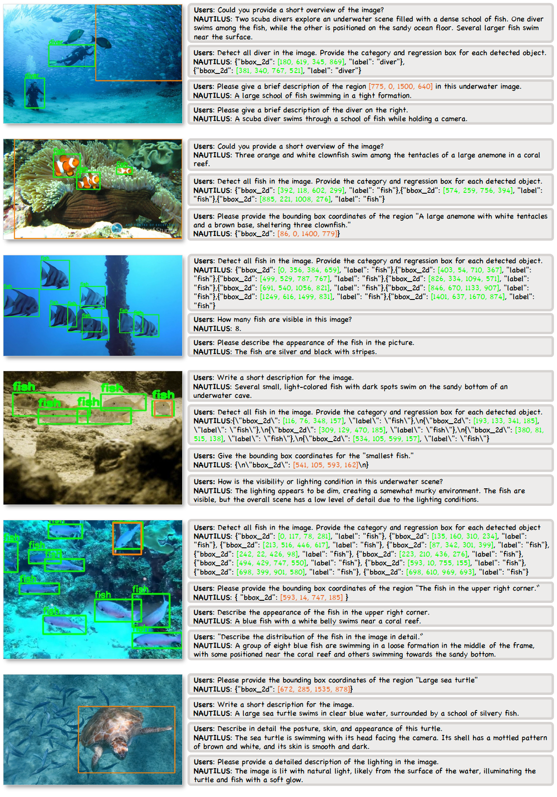

# NautData
[](https://huggingface.co/datasets/H-EmbodVis/NautData/tree/main)

We construct **NautData**, a large-scale underwater instruction-following dataset containing 1.45 M image-text pairs, enabling developments and evaluations of underwater MLLMs. 

<p align="center">
    
<p> 

## Key features
- Extensive underwater information encompassing image-, region-, and object-level understanding.
- Diverse conversational structures, including both rule-based and free-form content.
- Significant scale, comprising $158$ K images and $1.45$ M QA pairs.

## Distribution of NautData
<p align="center">
    
<p>  

## Data engine
<p align="center">
    
<p>

## Download
1. To facilitate quick access, the processed images are made available [here](https://huggingface.co/datasets/H-EmbodVis/NautData/tree/main).
2. You can also follow the detailed instructions in `./Images/*/readme.md` to prepare the NautData images. Additionally, a representative subset of images from each dataset is provided to facilitate a quick understanding of **NautData**.

## Visualization

<p align="center">
  
<p>

## Task and chat Data format
NautData includes eight tasks covering understanding at three granularities: image-, region-, and object-levels.  
### Image caption & VQA data
```
  {
    "id": "0",
    "image": "path/to/image.jpg",
    "conversations": [
      {
        "from": "human",
        "value": "<image>\nuser input" # Image caption prompt/visual question
      },
      {
        "from": "gpt",
        "value": "assistant output" # Image caption/visual answer
      }
    ]
  }
```
### Region caption data
```
  {
    "id": "1",
    "image": "path/to/image.jpg",
    "conversations": [
      {
        "from": "human",
        "value": "<image>\nPlease give a brief description of the region [bbox] in this underwater image." # [bbox] is pixel coordinate when applying Nautilus(Qwen), and [bbox] is normalized coordinate when applying Nautilus(LLaVA)
      },
      {
        "from": "gpt",
        "value": "Region caption" # Data sourced from multiple LMMs
      }
    ]
  },
```
### Grounding data
```
<!-- LLaVA format -->
  {
    "id": "2",
    "image": "path/to/image.jpg",
    "conversations": [
      {
        "from": "human",
        "value": "<image>\nPlease locate the bounding box coordinates of the region [Region caption]." 
      },
      {
        "from": "gpt",
        "value": "bbox" # Normalized coordinate
      }
    ]
  },
<!-- Qwen2.5 format -->
  {
    "id": "2",
    "image": "path/to/image.jpg",
    "conversations": [
      {
        "from": "human",
        "value": "<image>\nPlease locate the bounding box coordinates of the region [Region caption] in json format." 
      },
      {
        "from": "gpt",
        "value": "{\n\"bbox_2d\": [x1, y1, x2, y2]\n}" # Pixel coordinate
      }
    ]
  },
```
### Detection data
```
<!-- LLaVA format -->
  {
    "id": "3",
    "image": "path/to/image.jpg",
    "conversations": [
      {
        "from": "human",
        "value": "<image>\nDetect all underwater object in the image, including class1, class2, ..., classN. Provide the category and regression box for each detected object." 
      },
      {
        "from": "gpt",
        "value": "label1:bbox1\nlabel2:bbox2\n...\nlabelM:bboxM" 
      }
    ]
  },
<!-- Qwen2.5 format -->
  {
    "id": "3",
    "image": "path/to/image.jpg",
    "conversations": [
      {
        "from": "human",
        "value": "<image>\nDetect all underwater object in the image, including class1, class2, ..., classN. Provide the category and regression box for each detected object." 
      },
      {
        "from": "gpt",
        "value": "{\"bbox_2d\": [bbox1], \"label\": \"lable 1\"}, ... \n{\"bbox_2d\": [bboxM], \"label\": \"label M\"}" 
      }
    ]
  },
```
### Refering object classification data
```
  {
    "id": "4",
    "image": "path/to/image.jpg",
    "conversations": [
      {
        "from": "human",
        "value": "<image>\nClassify the object located inside the provided regression box [bbox]. Choose one of the following categories as the answer:class1, class2, ..., classN." # [bbox] is pixel coordinate when applying Nautilus(Qwen), and [bbox] is normalized coordinate when applying Nautilus(LLaVA)
      },
      {
        "from": "gpt",
        "value": "label" 
      }
    ]
  },
```
### Fine fish classification data
```
  {
    "id": "5",
    "image": "path/to/image.jpg",
    "conversations": [
      {
        "from": "human",
        "value": "<image>\nWhat is the biological class of the fish in the image? Choose one of the following categories as the answer::class1, class2, ..., classN." 
      },
      {
        "from": "gpt",
        "value": "label" 
      }
    ]
  },
```
### Counting data
Choice data:
```
  {
    "id": "6",
    "image": "path/to/image.jpg",
    "conversations": [
      {
        "from": "human",
        "value": "<image>\nFind out how many fish are in the image and select the appropriate choice from the options below.\nA:N1\nB:N2\nC:N3\nD:N4\n" # The interval between options is selected from [5, 50, 100], and the order of the options will be shuffled.
      },
      {
        "from": "gpt",
        "value": "option"
      }
    ]
  },
```
Regression data:
```
  {
    "id": " 7",
    "image": "path/to/image.jpg",
    "conversations": [
      {
        "from": "human",
        "value": "<image>\nPlease count how many fish are in this image."
      },
      {
        "from": "gpt",
        "value": "num"
      }
    ]
  },
```
## Directory Structure of the Dataset
```
├──Images
    ├──aquarium_UOD
      ├── ...
    ├──Brackish
      ├── ...
    ├──Deepfish
      ├── ...
    ├──Fishnet
      ├── ...
    ├──IOCfish5k
      ├── ...
    ├──RUOD
      ├── ...
    ├──UIIS
      ├── ...
    ├──Underwater_garbage
      ├── ...
    ├──USIS10k
      ├── ...
    └──UVOT-400
      ├── ...
```
## Citation

If you find this repository useful in your research, please consider giving a star ⭐ and a citation.
```bibtex
@inproceedings{xu2025nautilus,
        title={NAUTILUS: A Large Multimodal Model for Underwater Scene Understanding},
        author={Xu, Wei and Wang, Cheng and Liang, Dingkang and Zhao, Zongchuang and Jiang, Xingyu and Zhang, Peng and Bai, Xiang},
        booktitle={Advances in Neural Information Processing Systems},
        year={2025}
  }
```


