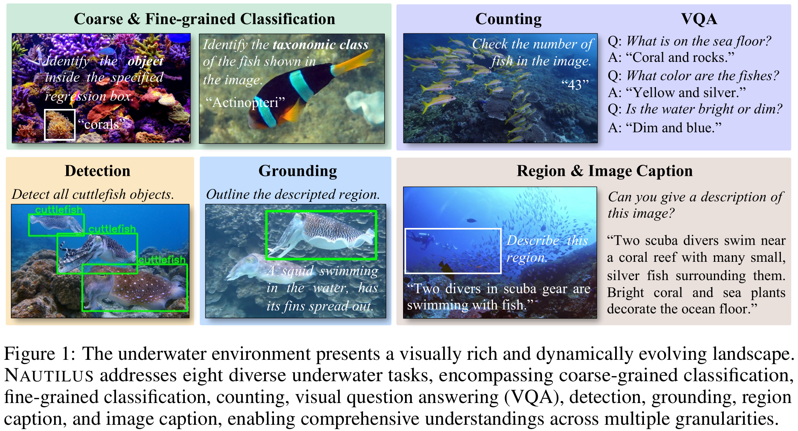

<div  align="center">    
 
</div>

<div align="center">
<h1>NAUTILUS: A Large Multimodal Model for Underwater Scene Understanding</h1>

Wei Xu<sup>1\*</sup>, Cheng Wang<sup>1\*</sup>, [Dingkang Liang](https://dk-liang.github.io/)<sup>1</sup>, Zongchuang Zhao<sup>1</sup>, Xingyu Jiang<sup>1</sup>, Peng Zhang<sup>2</sup>, [Xiang Bai](https://scholar.google.com/citations?user=UeltiQ4AAAAJ&hl=en)<sup>1</sup>

<sup>1</sup>  Huazhong University of Science & Technology, <sup>2</sup>  National University of Defense Technology

(\*) Equal contribution.

[](https://arxiv.org/abs/2510.27481)
[](https://github.com/H-EmbodVis/NAUTILUS/tree/dataset?tab=readme-ov-file)
[](https://h-embodvis.github.io/NAUTILUS/)
[](https://github.com/tatsu-lab/stanford_alpaca/blob/main/LICENSE)

</div>

## News
- `[2025/10/30]`  Release the official version of NAUTILUS.
- `[2025/09/18]`  NAUTILUS is accepted to NeurIPS 2025! 🥳🥳🥳

## Contents
- [Introduction](#introduction)
- [Install](#install)
- [Dataset](#dataset)
- [Train](#train)
- [Model Weights](#model-weights)
- [Local Inference](#local-inference)
- [Evaluation](#evaluation)

## Introduction

### Contributions
NAUTILUS contributes to three aspects:
1.  We construct NautData, a large-scale underwater instruction-following dataset containing 1.45 M image-text pairs, enabling developments and evaluations of underwater LMMs. 
2.  We build the first eight-task underwater LMM NAUTILUS, achieving underwater scene understanding from image, region, and object levels. It empowers comprehensive underwater scene understanding through aggregating hierarchical scene information.
3.  We design a plug-and-play VFE module motivated by a physical underwater imaging model. It restores degraded information explicitly in the feature space. Experiments on renowned baselines demonstrate its effectiveness on all the annotated tasks.

### Pipeline
NAUTILUS comprises an image encoder, a depth encoder, a vision-to-language projector, a Vision Feature Enhancement (VFE) module, and an LLM. The proposed VFE module performs feature-space enhancement guided by physical priors through two sequential steps: (1) removing backscattering and (2) restoring light absorption.

<div align="center">
    
</div>

### NAUTILUS Performance
<table style="text-align: center; caption-side: top;">
  <caption><b> Performance of our NAUTILUS. </b></caption>
  <thead>
    <tr>
      <th rowspan="3" style="text-align:center;">Methods</th>
      <th colspan="2" style="text-align:center;">Classification</th>
      <th colspan="2" style="text-align:center;">Caption</th>
      <th colspan="2" style="text-align:center;">Grounding</th>
      <th colspan="2" style="text-align:center;">Detection</th>
      <th style="text-align:center;">VQA</th>
      <th style="text-align:center;">Counting</th>
    </tr>
    <tr>
      <th style="text-align:center;">Coarse </th><th style="text-align:center;">Fine </th>
      <th style="text-align:center;">Image </th><th style="text-align:center;">Region </th>
      <th rowspan="2" style="text-align:center;">mIoU </th><th rowspan="2" style="text-align:center;">PR@0.5 </th>
      <th rowspan="2" style="text-align:center;">mAP </th><th rowspan="2" style="text-align:center;">mAP@0.5 </th>
      <th rowspan="2" style="text-align:center;">METEOR </th><th rowspan="2" style="text-align:center;">MAE ↓</th>
    </tr>
    <tr>
      <th style="text-align:center;">acc </th><th style="text-align:center;">acc </th>
      <th style="text-align:center;">METEOR </th><th style="text-align:center;">METEOR </th>
  </thead>
  <tbody>
    <!-- NAUTILUS variants -->
    <tr align="center">
      <td><b>NAUTILUS (LLaVA-1.5)</b></td>
      <td>91.0</td><td>89.9</td>
      <td>0.208</td><td>0.191</td>
      <td>46.2</td><td>52.2</td>
      <td>11.1</td><td>20.9</td>
      <td>0.365</td><td>51.2</td>
    </tr>
    <tr align="center">
      <td><b>NAUTILUS (Qwen2.5-VL)</b></td>
      <td>90.3</td><td>93.8</td>
      <td>0.223</td><td>0.199</td>
      <td>53.8</td><td>58.8</td>
      <td>25.8</td><td>45.3</td>
      <td>0.381</td><td>30.9</td>
    </tr>
  </tbody>
</table>


## Install


1. Clone this repository and navigate to NAUTILUS folder
```bash
git clone https://github.com/Chengnotwang/NAUTILUS.git
cd NAUTILUS
```

2. Environment Setup for NAUTILUS (LLaVA)

    **Recommended Environment**  
- CUDA 12.1
- Python 3.10

```Shell
# 1. Create a new conda environment
conda create -n nautilus_llava python=3.10 -y
conda activate nautilus_llava
# 2. Install requirements
cd LLaVA
pip install --upgrade pip  # enable PEP 660 support
pip install -e .
# 3. Install flash-attn
pip install flash-attn==2.6.3 --no-build-isolation
# If installation fails, install the pre-built wheel from [https://github.com/Dao-AILab/flash-attention/releases/tag/v2.6.3] instead:
pip install flash_attn-2.6.3+cu123torch2.1cxx11abiFALSE-cp310-cp310-linux_x86_64.whl
```

3. Environment Setup for NAUTILUS (Qwen)

    **Recommended Environment**  
- CUDA 12.4
- Python 3.10
```shell
# 1. Create a new conda environment
conda create -n nautilus_qwen python=3.10 -y
conda activate nautilus_qwen
# 2. Install requirements
cd qwen-vl-finetune
pip install -r requirements.txt
# 3. Install flash-attn-2.7.3
pip install flash-attn==2.7.3 --no-build-isolation
# If installation fails, install the pre-built wheel from [https://github.com/Dao-AILab/flash-attention/releases/tag/v2.7.3] instead:
pip install flash_attn-2.7.3+cu12torch2.5cxx11abiFALSE-cp310-cp310-linux_x86_64.whl
```
## Dataset
#### For details on NautData and `training / evaluation` preparation, please refer to [NautData](https://github.com/H-EmbodVis/NAUTILUS/tree/dataset).

## Train
### Dataset Preparation and Preprocessing
Ensure that the [NautData](https://github.com/H-EmbodVis/NAUTILUS/tree/dataset) is fully downloaded and the corresponding annotation files are correctly organized as described in the previous section. Once prepared, you can proceed with the training instructions below.

### NAUTILUS (LLaVA)

1. Download [llava-v1.5-mlp2x-336px-pretrain-vicuna-7b-v1.5](https://huggingface.co/liuhaotian/llava-v1.5-mlp2x-336px-pretrain-vicuna-7b-v1.5) and [depth_anything_v2_vitl.pth](https://github.com/DepthAnything/Depth-Anything-V2?tab=readme-ov-file).

2. (Optional) Preprocess the `depth_anything_v2_vitl.pth` weights into `dino_vitl.pth` by running the [process_vitl_weight.py](utils/process_vitl_weight.py). Then, place the generated file in the directory specified in the finetuning [script](LLaVA/scripts/nautilus_finetune/finetune_nautilus_lora.sh).

3. Fine-tune NAUTILUS (LLaVA) with the provided [script](./LLaVA/scripts/nautilus_finetune/finetune_nautilus_lora.sh), in accordance with the instructions detailed below.
```shell
# Remove useless parameters and rename reamin parameters
python utils/process_vitl_weight.py --dav2-vitl "path to depth_anything_v2_vitl.pth" --dinov2-vitl "dinov2 only pth file"
conda activate nautilus_llava
cd LLavA
# Before training, please make sure to modify the path of the checkpoint and others hyper-parameters in the script
# Start training
bash scripts/nautilus_finetune/finetune_nautilus_lora.sh
```

### NAUTILUS (Qwen)

1. We use the [Qwen2.5-VL-7B-Instruct](https://huggingface.co/Qwen/Qwen2-VL-7B-Instruct) model in our experiments. You may also choose other Qwen2.5-VL variants if desired.

2. Verify that the annotation_path and data_path for Nautilus_Instruct are correctly configured in this [file](qwen-vl-finetune/qwenvl/data/__init__.py#L4-7).

3. Run the NAUTILUS (Qwen) fine-tuning [script](./qwen-vl-finetune/scripts/nautilus_finetune/nautilus_lora_sft_7b_lora.sh).
```shell
conda activate nautilus_qwen
cd qwen-vl-finetune
# Make sure to modify the path and others hyper-parameters in the script
# Start training
bash scripts/nautilus_finetune/nautilus_sft_7b_lora.sh
```

## Model Weights 
<table style="text-align:center; margin:auto;">
  <thead>
    <tr>
      <th rowspan="1" style="text-align:center;">Model</th>
      <th colspan="1" style="text-align:center;">config</th>
      <th colspan="1" style="text-align:center;">Download</th>
      <th colspan="1" style="text-align:center;">Train log</th>
      <th colspan="1" style="text-align:center;">Eval json</th>
    </tr>
  </thead>
  <tbody>
    <!-- NAUTILUS variants -->
    <tr align="center">
      <td><b>NAUTILUS (LLaVA-1.5)</b></td>
      <td><a href="./LLaVA/scripts/nautilus_finetune/finetune_nautilus_lora.sh" target="_blank">config</a></td>
      <td><a href="https://huggingface.co/H-EmbodVis/Nautilus-llava-instruct-7b" target="_blank">Huggingface</a></td>
      <td><a href="./logs/llava_logs.json" target="_blank">log</a></td>
      <td><a href="./logs/llava_eval.json" target="_blank">json</a></td>
    </tr>
    <tr align="center">
      <td><b>NAUTILUS (Qwen2.5-VL)</b></td>
      <td><a href="./qwen-vl-finetune/scripts/nautilus_finetune/nautilus_lora_sft_7b_lora.sh" target="_blank">config</a></td>
      <td><a href="https://huggingface.co/H-EmbodVis/Nautilus-qwen-instruct-7b" target="_blank">Huggingface</a></td>
      <td><a href="./logs/qwen_logs.json" target="_blank">log</a></td>
      <td><a href="./logs/qwen_eval.json" target="_blank">json</a></td>
    </tr>
  </tbody>
</table>

## Local Inference
### NAUTILUS (LLaVA)
Single-Sample Inference for NAUTILUS (LLaVA)
```shell
cd LLaVA
CUDA_VISIBLE_DEVICES=0 python scripts/inference/inference.py --model-path "path to checkpoint" --dinov2-weight "path to dinov2" --image "path to image" --prompt "question"
# prompt default is "Describe the image"
```

### NAUTILUS (Qwen)
Single-Sample Inference for NAUTILUS (Qwen)
```shell
cd qwen-vl-finetune
CUDA_VISIBLE_DEVICES=0 python scripts/inference.py --checkpoint "path to checkpoint" --image "path to image" --prompt "question"
# prompt default is "Describe the image"
```

## Evaluation

We provide a simple evaluation script for evaluating the performance of NAUTILUS.
```shell
# for evaluation
bash eval/eval_nautilus_llava.sh # for Nautilus (LLaVA)
bash eval/eval_nautilus_qwen.sh # for Nautilus (Qwen)
```

## Acknowledgement
Sincere acknowledgment to the amazing open-source community for their great contributions:
- [LLaVA](https://github.com/haotian-liu/LLaVA): for the excellent work and inspiring codebase.
- [Qwen-2.5-VL](https://github.com/QwenLM/Qwen3-VL): for the powerful open-source model and codebase (now updated to Qwen-3-VL).
- [Depth AnythingV2](https://github.com/DepthAnything/Depth-Anything-V2): for the impressive work and for sharing their model weights with the community.

## Citation

If you find this repository useful in your research, please consider giving a star ⭐ and a citation.
```bibtex
@inproceedings{xu2025nautilus,
        title={NAUTILUS: A Large Multimodal Model for Underwater Scene Understanding},
        author={Xu, Wei and Wang, Cheng and Liang, Dingkang and Zhao, Zongchuang and Jiang, Xingyu and Zhang, Peng and Bai, Xiang},
        booktitle={Advances in Neural Information Processing Systems},
        year={2025}
  }
```